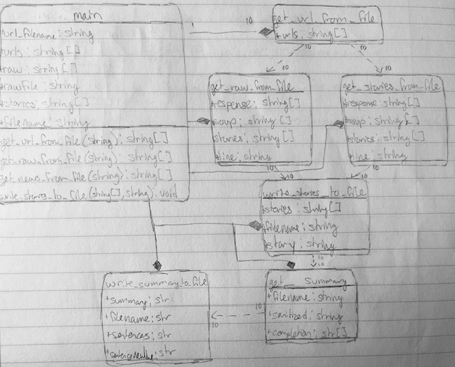

<a name="readme-top"></a>

<br/>
<div align="center">
  <a href="https://github.com/sbar821/BBC-Article-Scraper">
  <!-- news icon from Icons8 -->
    
  </a>

<h1 align="center">CBS News  Article Scraper</h1>

  <h3 align="center">
    This webscraper takes ten URLs from .txt file, scrapes them for relevant information ignoring advertisements, images, and links to other articles. It then takes the text and puts them in five separate files.
  </h3>
  <br>
  <br>
</div>

## About The Project
### The file "main.py" has the code to read in links to ten CBS new articles and convert them to raw text- no ads, images, or links to other articles. It utilizes beautifulsoup, a python package, and requests, a python library, to simplify the scraping process. Main calls a few different functions- one to read in links, to scrape the text, then to write to a new file. Each of these (along with main) include exception handling such as link not working or being unretrievable. 

### The file "url.txt"  contains a list of CBS World articles, each article is separated by a new line. You substitute any article for another CBS one, however anything exceeding ten will not be read.

### The files such as "story1.txt" (also 2,3,4, etc) are the articles scraped by the program. They contain a summary of each article in plain text. Upon running the program with the links, it will create them (if they are not already created, else it will overwrite them). Not necessary to run, just here to show the results of program running.

### The file "requirements.yml" contains the conda environment needed to run the code in this repository. You will need to take this file and import into your virtual environment using conda.

## Getting Started

To get the web scraper up and running, these steps are operating on the assumption that you already have conda installed locally.

* Clone the repo
   ```sh
   git clone https://github.com/sbar821/CBS-Article-Scraper
   ```

* To create the conda environment, type the following:
  ```sh
  conda env create -f requirements.yml
  ```
* Find ten CBS articles (or use ones already in the file) and put it into url.txt with each url terminated with a new line.


* Run main.py using the conda environment or Visual Studio Code with conda as the interpreter.

* Watch as the story1.txt and beyond are filled with the news articles selected! (Please note it only works with CBS news articles due to specific HTML tags used)

## Utilizing OpenAI's GPT-3.5-Turbo API for Generating Summaries

* Before even running the code, you need to set up an account on [OpenAI](https://openai.com/) and get your API key (KEEP THIS SAFE!!). For this to work, you need to ensure you have enough credits on your account. By creating a new one it will ensure that you will have $5 worth of credits. Then, create a .env file in CS325_p2 folder and put your key in the file. 

* The .gitignore will prevent the .env from being added to your repository so it will keep your key safe. 

* Following proper set up, you can query the API by calling 

  ```sh
  completion = openai.chat.completions.create(
  model="gpt-3.5-turbo",
  messages=[{"role": "user", "content": f'Write your prompt here'}]
  )
  ```
* You can use the results of the query by referring to `completion.choices[0].message.content` in your code. You can substitute 0 for other numbers if your code results in multiple outputs.

* In the case of this article scraper, we return the summary provided and use it as an input along with a filename to write the summaries to a .txt file.

## UML Diagram
<div align="center">
    
  </a>

<p align="center">(<a href="#readme-top">back to top</a>)</p>
